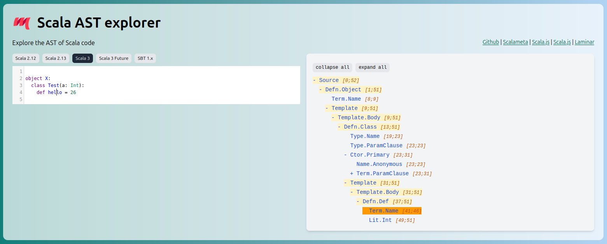

A great way to learn about the structure of Scalameta syntax trees is
[Scalameta AST explorer](https://github.com/keynmol/scalameta-ast-explorer).

<!--
 -->

<a href="https://keynmol.github.io/scalameta-ast-explorer/" target="_blank" class="button">
Go to Scalameta AST explorer
</a>

---

---
